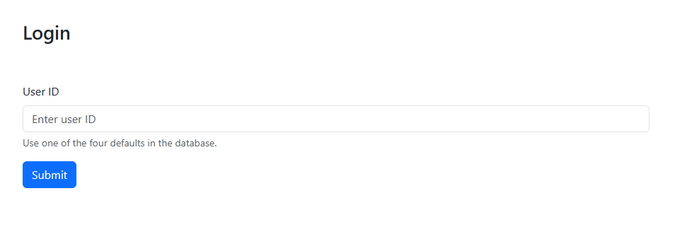
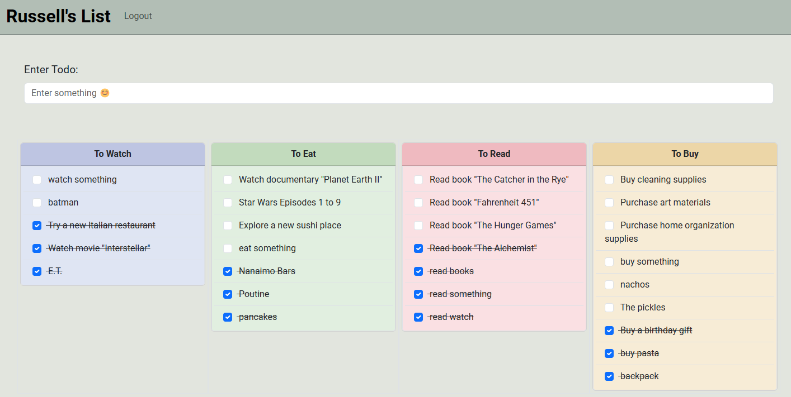

# Smart Todo List

A smart TODO list web app with auto-categorization

## Getting Started

1. Create the `.env` by using `.env.example` as a reference: `cp .env.example .env`
2. Update the .env file with your correct local information 
  - username: `labber` 
  - password: `labber` 
  - database: `midterm`
3. Install dependencies: `npm i`
4. Fix to binaries for sass: `npm rebuild node-sass`
5. Reset database: `npm run db:reset`
  - Check the db folder to see what gets created and seeded in the SDB
7. Run the server: `npm run local`
  - Note: nodemon is used, so you should not have to restart your server
8. Visit `http://localhost:8080/`

## Features

1. Auto categorization of todo items
2. Drag and drop to re-categorize items
3. Check items as complete
4. Login to view items

## Screenshots

Login Page

Items Page

## Warnings & Tips

- Do not edit the `layout.css` file directly, it is auto-generated by `layout.scss`.
- Split routes into their own resource-based file names, as demonstrated with `items.js`.
- Split database schema (table definitions) and seeds (inserts) into separate files, one per table. See `db` folder for pre-populated examples. 
- Use helper functions to run your SQL queries and clean up any data coming back from the database. See `db/queries` for pre-populated examples.
- Use the `npm run db:reset` command each time there is a change to the database schema or seeds. 
  - It runs through each of the files, in order, and executes them against the database. 
  - Note: you will lose all newly created (test) data each time this is run, since the schema files will tend to `DROP` the tables and recreate them.

## Dependencies

- Node 10.x or above
- NPM 5.x or above
- PG 6.x
- jQuery
- Bootstrap

